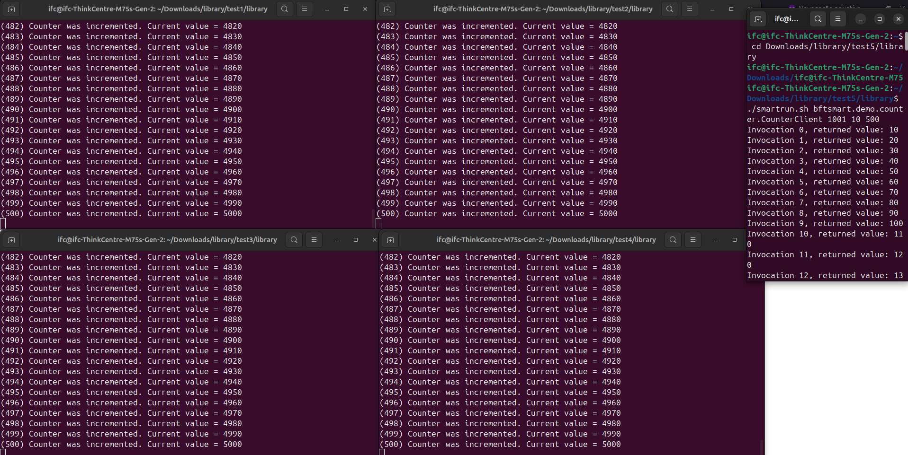

## Comandos executados:
* Terminal 1 (Server 1) - ./smartrun.sh bftsmart.demo.counter.CounterServer 0
* Terminal 2 (Server 2)- ./smartrun.sh bftsmart.demo.counter.CounterServer 1
* Terminal 3 (Server 3)- ./smartrun.sh bftsmart.demo.counter.CounterServer 2
* Terminal 4 (Server 4)- ./smartrun.sh bftsmart.demo.counter.CounterServer 3
* Terminal 5 (Client)- ./smartrun.sh bftsmart.demo.counter.CounterClient 1001 10 500

