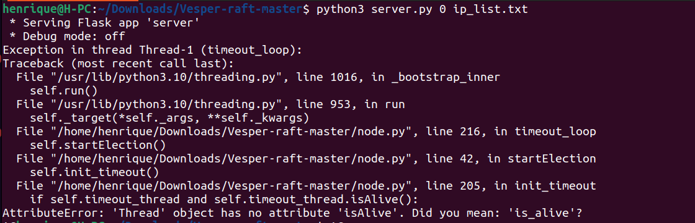
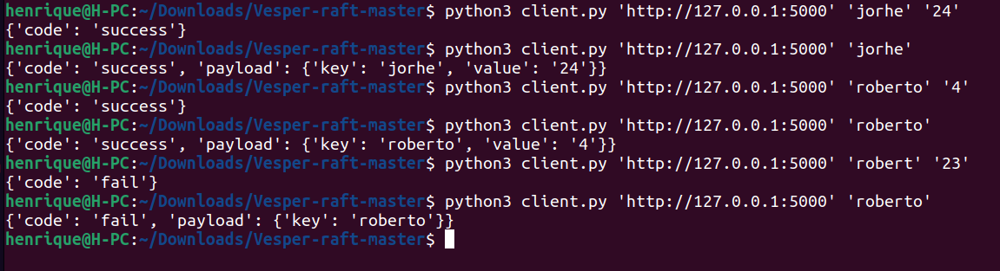
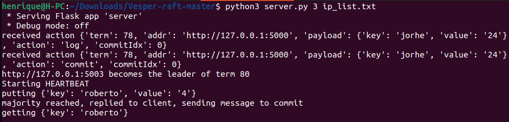
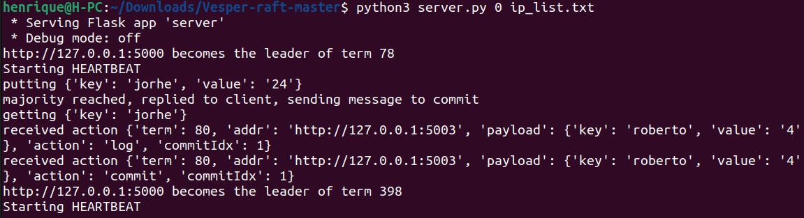
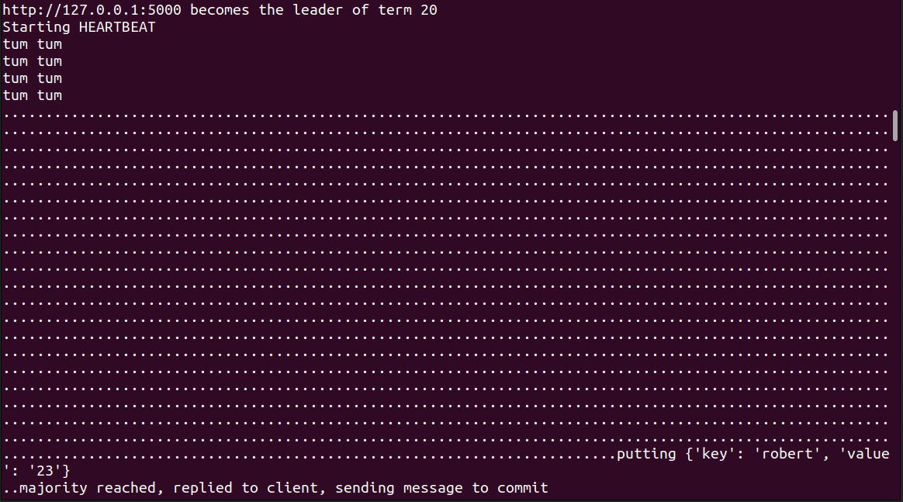

# Execucao RAFT

Repositorio do código que foi testado: https://github.com/Oaklight/Vesper-raft.git

# Primeiro passo: 

Corrigir o erro do codigo(substituir isAlive por is_alive na linha 205 do node.py):

# Executando

## Nodes

python3 server.py 0 ip_list.txt
python3 server.py 1 ip_list.txt
python3 server.py 2 ip_list.txt
python3 server.py 3 ip_list.txt

## Client
python3 client.py 'http://127.0.0.1:5000' 'robert' '123'

## Líder:

## Eleição:

## HeartBeat

