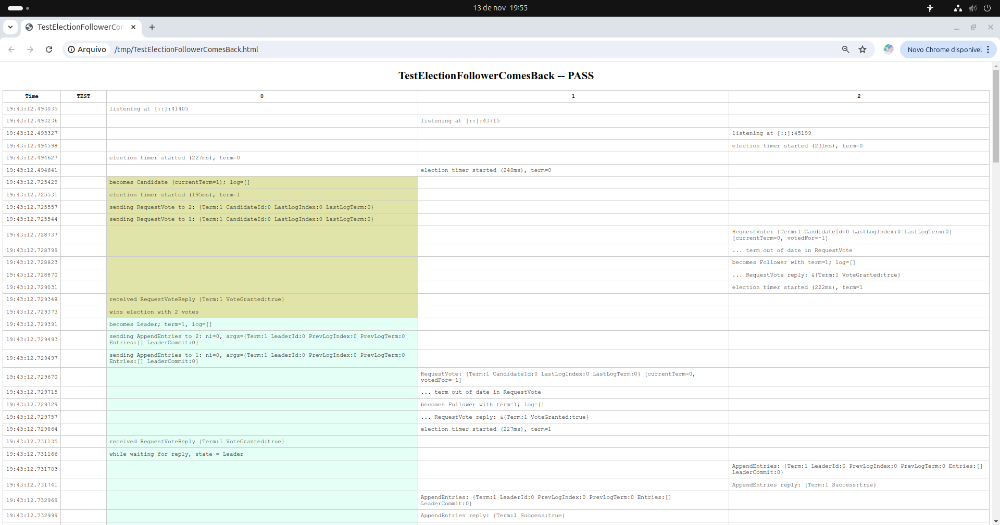
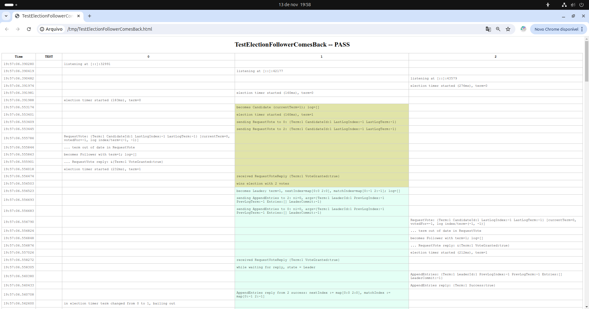

# Batatinha 🥔

## Link do Repositório utilizado nos testes:

```js
https://github.com/eliben/raft
```

## Comandos executados (parte 1)

```bash
cd part1
go test -v -race -run TestElectionFollowerComesBack |& tee /tmp/raftlog
go run ../tools/raft-testlog-viz/main.go < /tmp/raftlog
```
## Resultados: 


## Comandos executados (parte 2)
```bash
cd part2/
go test -race ./...
go test -v -race -run TestElectionFollowerComesBack |& tee /tmp/raftlog
go run ../tools/raft-testlog-viz/main.go < /tmp/raftlog
```

## Resultados: 


## Caminho do arquivo editado (com a constante) -> 
```bash
batatinha/raft/part2/raft_test.go
```