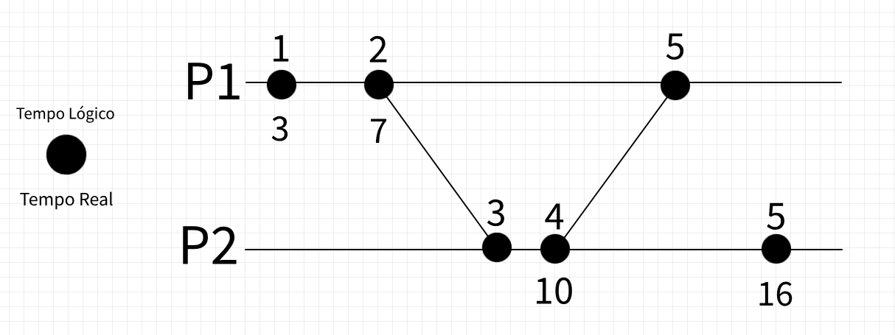
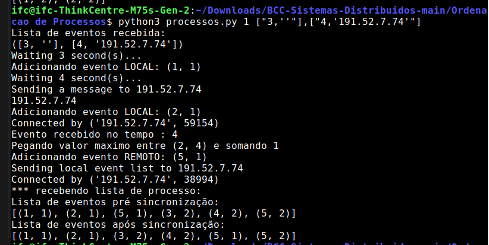

# Como executar

Adicione a lista de IPs no config.py NA MESMA ORDEM EM TODOS OS COMPUTADORES
Execute:
P1: python3 processos.py 1 ["3,''"],["4,'191.52.7.74'"]
P2: python3 processos.py 2 ["10,''"],["6,'191.52.7.73'"]

# O que significa

P1 ESPERA 3 SEGUNDOS E GERA UM EVENTO LOCAL
P1 ESPERA 4 SEGUNDOS E ENVIA UM EVENTO PARA P2

P2 ESPERA 10 SEGUNDOS E GERA UM EVENTO LOCAL
P2 ESPERA 6 SEGUNDOS E ENVIA UM EVENTO PARA P1

# Previsão

ORDEM DOS EVENTOS

P1 1
P1 2
P2 3
P2 4
P1 5
P1 5

# Resultados

#
