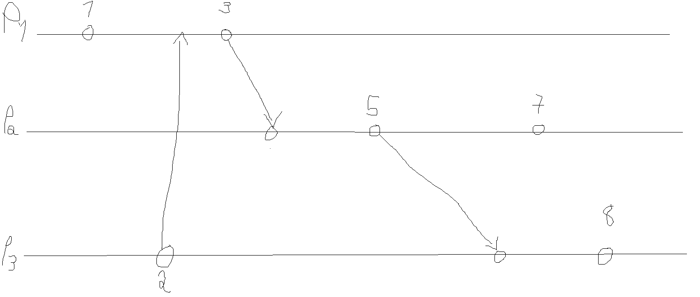
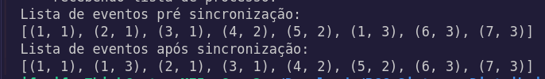

# Batata 🥔

# Comandos Executados:
* P1 - python3 processos.py 1 ["1,''"],["3, '191.52.7.85'"]
* P2 - python3 processos.py 2 ["5, '191.52.7.86'"], ["7,''"]
* P3 - python3 processos.py 3 ["2,'191.52.7.84'"],["8,''"]

# Exibição Prevista

# Exibição Obtida
