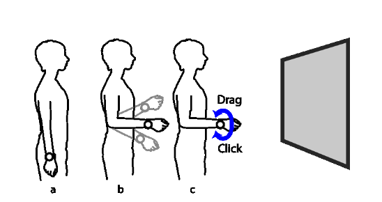
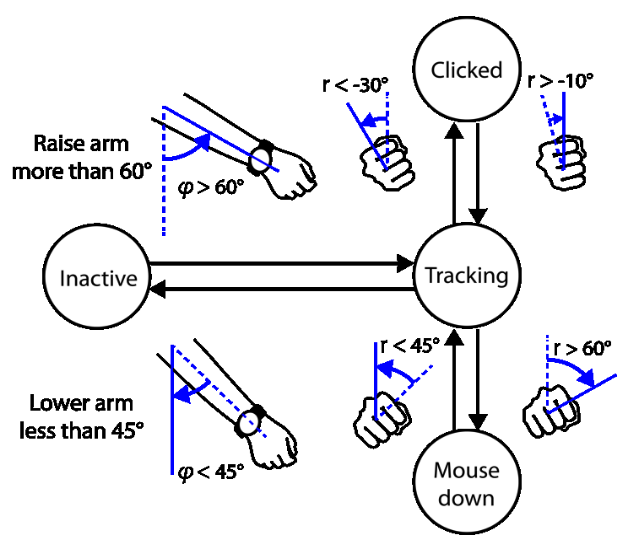

## Exemplo de computação ubíqua

Artigo: 

Keiko Katsuragawa, Krzysztof Pietroszek, James R. Wallace, and Edward Lank. 2016. Watchpoint: Freehand Pointing with a Smartwatch in a Ubiquitous Display Environment. In Proceedings of the International Working Conference on Advanced Visual Interfaces (AVI '16). Association for Computing Machinery, New York, NY, USA, 128–135. https://doi.org/10.1145/2909132.2909263

Link: https://encurtador.com.br/2muQx

Nesse artigo é apresentada uma alternativa para o cursor do mouse através de um dipositivo *Smartwatch*, utilizando ele o usuario pode simular um mouse através de gestos feitos com o dispotivo.

Nessa imagem é possivel ver a dinâmica do uso do aparelho através da computação ubíqua:

Abaixo pode-se observar que de fato, os movimentos realizados via mouse são englobados por esse dispositivo, podendo substituir o original.

